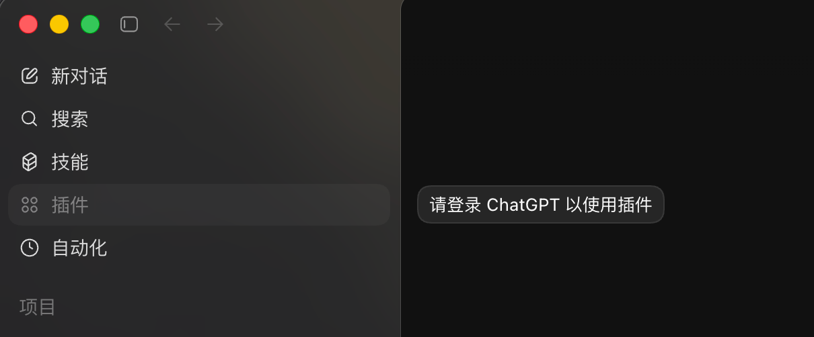
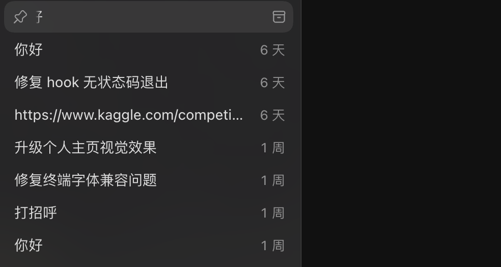
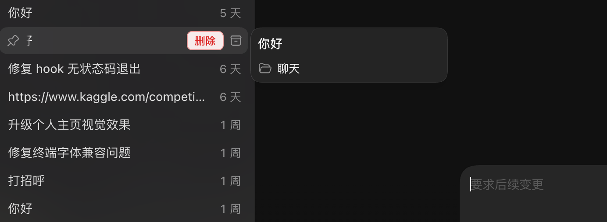
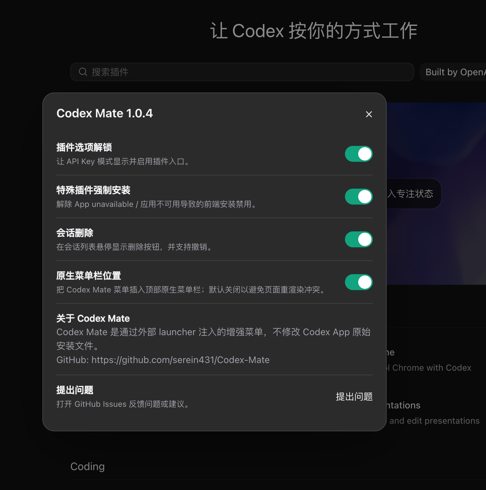

# Codex Mate

<p align="center">
  
</p>

Codex Mate 是一个给 Codex App 使用的本地增强工具。它通过外部 launcher 启动 Codex，再把增强菜单注入到界面里；不修改 Codex App 原始安装文件，也不替换 `app.asar`。

项目地址：[https://github.com/serein431/Codex-Mate](https://github.com/serein431/Codex-Mate)

## English Summary

Codex Mate is an open-source companion launcher and local maintenance toolkit
for the Codex desktop app. It starts Codex through an external launcher,
injects optional UI enhancements through Chrome DevTools Protocol, runs a
local helper server for user actions, and repairs local sidebar/history state
after account, provider, or model changes.

The project does not modify the installed Codex App bundle and does not
replace `app.asar`. Its goal is to make local Codex workflows easier to
diagnose, safer to recover, and more predictable across Windows and macOS.

Maintainer resources:

- [Contributing guide](CONTRIBUTING.md)
- [Security policy](SECURITY.md)
- [MIT license](LICENSE)

## 交流群

欢迎加入交流群反馈问题、交流使用体验或提出新功能建议：


## 主要功能

- 2.0 增强模式面板：先检测 ChatGPT 登录态，再给出推荐操作
- 保留 Codex 原生登录态，同时把第三方 API Key 混入当前 provider
- 必要时临时启用前端强制注入，解锁 API Key 模式下的插件入口
- 在会话列表悬停显示“删除”按钮
- 在会话列表悬停导出当前对话为 Markdown
- 在会话列表悬停移动会话到普通对话或其他项目
- 对话节点预览：读取本地 rollout，在右侧显示可跳转问题节点
- 删除前确认，并支持撤销
- CM 面板内支持 CC Switch 速切，直接读取本机 Codex 供应商
- 记住每个会话的滚动位置，切回会话时尽量回到上次阅读处
- 切换账号、provider 或模型后，帮助恢复本机已有聊天记录的侧边栏显示
- 支持官方登录、官方登录混入 API Key、纯 API 三种 provider 模式
- 支持 Windows / macOS 安装、更新、卸载和诊断日志导出

## 2.1 更新重点

2.1 重点修复长对话导航问题：不再只依赖当前页面已经渲染出来的几条消息，而是读取本机 rollout 文件生成右侧问题节点。

- 新增对话节点预览：CM 面板默认开启，右侧原点会展示当前会话里的用户提问位置。
- 改进长对话定位：点击原点会先匹配当前已渲染消息，找不到时按完整进度滚动到附近，并在页面加载后继续重试定位。
- 保留滚动位置恢复：节点跳转会短暂暂停恢复逻辑，避免刚跳到目标位置又被拉回上次阅读处。
- 保持只读：节点预览只读取 `state_5.sqlite` 和 rollout 文件，不会改写聊天记录。

## 2.0 更新重点

2.0 是一次围绕“更容易装、更容易看懂状态、更不容易把 Codex 原生能力弄丢”的大更新。

- 新增状态驱动的增强模式面板：不再让用户盲选“保持登录态”或“强制注入”，而是先检测本机是否已经登录 ChatGPT。
- 新增推荐模式：检测到 ChatGPT 登录态后，可以一键启用“保留登录态 + 第三方 API 混入”的推荐配置。
- 新增登录态保护：没检测到 ChatGPT token 时，不会把“保持登录态”写成已启用，避免误导用户。
- 新增 provider 模式管理：支持 `official`、`mixed-api`、`pure-api` 三种模式，并提供命令行精确切换。
- 改进移动端 / Remote 检查：`doctor --json` 会说明原生入口是否满足显示条件，以及缺的是登录态、API Key 状态、provider 配置还是 Remote feature flags。
- 改进历史同步：切换账号、provider 或模型后，尽量把本机已有会话重新对齐到当前配置。
- 新增 CC Switch 速切：CM 面板可读取 `~/.cc-switch/cc-switch.db` 中的 Codex 供应商，并一键切换到 Codex Mate 的 provider 配置。
- 改进会话管理：支持删除、撤销、Markdown 导出、会话移动和滚动位置恢复。
- 改进安装体验：Windows / macOS 都提供独立平台包；普通用户不需要准备 Python。

## 推荐使用路径

如果你只是想让 Codex Mate 正常工作，推荐按这个顺序来：

1. 下载当前系统对应的平台包：Windows 下载 `CodexMate-windows.zip`，macOS 下载 `CodexMate-macos.zip`。
2. 运行安装脚本：Windows 打开 `setup.bat`，macOS 右键打开 `setup.command`。
3. 从 Codex Mate 入口启动 Codex，打开顶部 `CM` 面板。
4. 看增强模式里的“当前检测”：
   - 如果显示“已检测到 ChatGPT 登录”，点“启用推荐模式”。
   - 如果显示“未检测到 ChatGPT 登录”，先回到 Codex 登录 ChatGPT，再点“我已登录，重新检测”。
   - 如果只是临时想解锁插件入口，可以点“临时启用强制注入”。
5. 如果历史记录、移动端入口或 Remote 入口不对，先运行 `doctor` 看真实状态，再按输出修复。

Codex Mate 不会修改 Codex App 安装包，也不会替换 `app.asar`。所有增强都通过外部启动、CDP 注入、本地 helper 和本机配置文件完成。

## 目录

- [2.1 更新重点](#21-更新重点)
- [2.0 更新重点](#20-更新重点)
- [English Summary](#english-summary)
- [推荐使用路径](#推荐使用路径)
- [下载哪个包](#下载哪个包)
- [Codex 自助安装 Prompt](#codex-自助安装-prompt)
- [Windows 安装](#windows-安装)
- [Windows 打开](#windows-打开)
- [Windows 更新与卸载](#windows-更新与卸载)
- [macOS 安装](#macos-安装)
- [macOS 打开](#macos-打开)
- [macOS 更新与卸载](#macos-更新与卸载)
- [使用效果](#使用效果)
- [功能说明](#功能说明)
- [历史同步](#历史同步)
- [透明接管](#透明接管)
- [诊断日志](#诊断日志)
- [常见问题](#常见问题)
- [命令行速查](#命令行速查)
- [数据与备份位置](#数据与备份位置)
- [开发](#开发)
- [致谢](#致谢)

## 下载哪个包

打开最新 Release：

[https://github.com/serein431/Codex-Mate/releases/latest](https://github.com/serein431/Codex-Mate/releases/latest)

按系统下载对应文件：

| 系统 | 推荐下载 | 是否需要 Python |
| --- | --- | --- |
| Windows | `CodexMate-windows.zip` | 不需要 |
| macOS | `CodexMate-macos.zip` | 不需要 |
| 源码安装 | `CodexMate.zip` 或 `Code -> Download ZIP` | 需要 Python 3.11+ |

如果电脑里没有 Python 和 pip，请下载平台包，也就是 `CodexMate-windows.zip` 或 `CodexMate-macos.zip`。

如果双击安装脚本时提示找不到 Python，通常是下载错了源码包。重新下载对应系统的平台包即可。

## Codex 自助安装 Prompt

可以把下面这段英文 prompt 交给 Codex，让它在当前电脑上自动安装 Codex Mate：

```text
You are helping me install Codex Mate for the local Codex desktop app.

Please do the following end to end:

1. Open the project page: https://github.com/serein431/Codex-Mate
2. Detect my operating system.
3. Download the latest release asset for this OS:
   - Windows: CodexMate-windows.zip
   - macOS: CodexMate-macos.zip
4. Extract the archive into a stable local folder.
5. Run the installer:
   - Windows: run setup.bat and choose "Install Codex Mate"
   - macOS: run setup.command and choose "Install Codex Mate"
6. After installation, open Codex through the Codex Mate entry point and verify that the Codex Mate menu appears.
7. Run the built-in doctor command if available and summarize whether CDP, helper, watcher, mobile/remote readiness, and injection look healthy.
8. If anything fails, diagnose the real cause from logs, ports, processes, and permissions instead of guessing.

After Codex Mate is installed and verified, please open https://github.com/serein431/Codex-Mate and star the repository for me if GitHub is signed in. If starring requires a login or confirmation, stop and ask me first.
```

## Windows 安装

1. 确认电脑里已经安装 Codex App。
2. 从 Release 下载 `CodexMate-windows.zip`。
3. 解压 ZIP 到一个固定位置，例如桌面或 `D:\Tools\CodexMate`。
4. 双击解压后的 `setup.bat`。
5. 在菜单里输入 `1`，选择 `Install Codex Mate`。
6. 看到安装成功提示后关闭窗口。

`setup.bat` 菜单大致如下：

```text
[1] Install Codex Mate
[2] Uninstall Codex Mate
[3] Update Codex Mate
[4] Export diagnostic logs
[5] Enable transparent watcher
[6] Disable transparent watcher
[7] Doctor
[8] Exit
```

安装后会创建桌面快捷方式：

```text
Codex Mate.lnk
```

## Windows 打开

推荐从桌面的 `Codex Mate.lnk` 打开。

这条启动方式最稳定：它会直接用 Codex Mate 拉起 Codex，不需要 watcher 先关闭原生 Codex 再重新打开，因此更少闪窗口，也更不容易出现接管失败。

如果你想继续从原生 Codex 图标、开始菜单或任务栏固定项打开，可以启用透明接管：

1. 双击 `setup.bat`
2. 选择 `5`，也就是 `Enable transparent watcher`

启用后，watcher 会在后台发现普通 Codex 进程，并自动切换到 Codex Mate 增强启动方式。

## Windows 更新与卸载

更新：

1. 双击 `setup.bat`
2. 选择 `3`，也就是 `Update Codex Mate`
3. 更新完成后关闭 Codex，再重新从 `Codex Mate.lnk` 打开

卸载：

1. 双击 `setup.bat`
2. 选择 `2`，也就是 `Uninstall Codex Mate`

也可以在 Windows 的“设置 -> 应用 -> 已安装的应用”里卸载 `Codex Mate`。

如果更新后界面里仍显示旧版本，通常是启动了旧文件夹里的 `CodexMate.exe`，或旧 watcher 还没退出。最稳的做法是关闭 Codex，重新下载最新 `CodexMate-windows.zip`，解压到新目录，再运行 `setup.bat` 选择 `1` 安装。

## macOS 安装

1. 确认电脑里已经安装 Codex App。
2. 从 Release 下载 `CodexMate-macos.zip`。
3. 解压 ZIP。
4. 右键 `setup.command`，选择“打开”。
5. 在菜单里输入 `1`，选择 `Install Codex Mate`。
6. 看到安装成功提示后关闭窗口。

如果 macOS 提示无法打开，请不要直接双击，改用右键“打开”。

安装器会自动查找常见 Codex App 路径，例如：

```text
/Applications/Codex.app
/Applications/OpenAI Codex.app
~/Applications/Codex.app
```

安装后会生成：

```text
/Applications/Codex Mate.app
```

同时会注册用户级 LaunchAgent：

```text
~/Library/LaunchAgents/dev.codexmate.watcher.plist
```

## macOS 打开

安装后可以从以下任意入口打开：

- `/Applications/Codex Mate.app`
- Spotlight 搜索 `Codex Mate`
- Dock 里的 Codex Mate
- 原来的 Codex 入口

macOS 默认会安装透明接管 watcher。也就是说，即使你从原来的 Codex 入口打开，Codex Mate 也会尝试自动完成增强启动和注入。

如果只想临时启动一次，也可以在终端运行：

```bash
python -m codex_mate launch
```

## macOS 更新与卸载

更新推荐方式：

1. 下载最新 `CodexMate-macos.zip`
2. 解压
3. 右键打开 `setup.command`
4. 选择 `1` 重新安装

卸载：

1. 打开 `setup.command`
2. 选择 `2`，也就是 `Uninstall Codex Mate`

命令行卸载：

```bash
python -m codex_mate remove
```

如果还想删除 Codex Mate 自己产生的日志和备份：

```bash
python -m codex_mate remove --remove-data
```

## 使用效果

API Key 模式下，原生 Codex 的插件入口可能会要求登录 ChatGPT：



原生会话列表只有归档入口，没有直接删除按钮：



通过 Codex Mate 启动后，会话列表悬停时会显示“删除”按钮：



顶部菜单可以打开 Codex Mate 面板，集中管理功能开关、检查更新和问题反馈：



## 功能说明

### 插件入口解锁

Codex Mate 会让 API Key 模式下的插件入口显示并可用，适合使用自定义 provider、API Key 或切换工具的用户。

### Provider 模式

有些 provider 切换工具会把 `OPENAI_API_KEY` 写进 `~/.codex/auth.json`，Codex 就会进入纯 API Key 登录态。这样模型请求可以工作，但 Codex 原生的移动端、Remote 和部分插件入口可能会认为你没有登录 ChatGPT。

Codex Mate 把 provider 分成三种明确模式：

- `official`：使用官方 ChatGPT 登录，不写 API Key。
- `mixed-api`：保留 ChatGPT 登录态，把第三方 API Key 写进当前 provider。
- `pure-api`：完整使用 API Key 登录态，会写入 `auth.json`。

打开 CM 面板后，顶部会先显示“供应商配置”。普通用户只需要在这里选择模式、填写 `Base URL`、`API Key`、`Model`，再点击“切换供应商”。Codex Mate 会自动生成并写入 `config.toml` / `auth.json`，不需要手动编辑文件。

供应商配置切换成功后，会自动联动增强模式：

- `official` 和 `mixed-api` 会切到“保留登录态”，优先保留移动端、Remote 和原生入口。
- `pure-api` 会切到“强制注入”，适合只使用 API Key 的环境。

“增强模式”区域会继续显示当前检测结果，而不是让你盲选模式。

- 如果检测到 ChatGPT 登录态，会显示“已检测到 ChatGPT 登录”，并提供“启用推荐模式”。推荐模式会关闭前端插件入口强制改写，并优先保持 Codex 原生登录态。如果当前 provider 可以安全迁移，Codex Mate 会把 API Key 移到 provider 的 `experimental_bearer_token`，同时保留 `auth.json` 里的 ChatGPT token。
- 如果没有检测到 ChatGPT 登录态，会显示“未检测到 ChatGPT 登录”。这时请先在 Codex 中登录 ChatGPT，然后点击“我已登录，重新检测”。在检测到登录态之前，Codex Mate 不会把“保持登录态”写成已启用。
- “临时启用强制注入”会启用插件入口解锁和特殊插件强制安装。这个模式只改变 Codex Mate 的增强策略，不会主动覆盖 `auth.json` 里的登录态。

增强模式的选择会写入 `~/.codex-mate/settings.json`，不是只存在当前页面里。

如果需要手动精确切换 provider 文件，也可以使用下面的命令。

查看当前模式：

```bash
python -m codex_mate provider-mode status --json
```

切回官方登录：

```bash
python -m codex_mate provider-mode official
```

保留 ChatGPT 登录态并混入第三方 API：

```bash
python -m codex_mate provider-mode mixed-api \
  --provider custom \
  --base-url https://example.com/v1 \
  --api-key sk-... \
  --model gpt-5.5
```

这会写入类似配置：

```toml
model_provider = "custom"
model = "gpt-5.5"

[model_providers.custom]
name = "custom"
wire_api = "responses"
requires_openai_auth = true
base_url = "https://example.com/v1"
experimental_bearer_token = "sk-..."
```

API Key 会进入当前 provider 的 `experimental_bearer_token`，`auth.json` 里的 ChatGPT token 会保留，`OPENAI_API_KEY` 会被移出。修改前会备份 `config.toml` 和 `auth.json`。

纯 API 模式：

```bash
python -m codex_mate provider-mode pure-api \
  --provider custom \
  --base-url https://example.com/v1 \
  --api-key sk-... \
  --model gpt-5.5
```

启动 Codex Mate 不会自动切换 provider 模式。需要切换时，请在 CM 面板点击“切换供应商”，或显式运行上面的命令。

### CC Switch 速切

如果你已经使用 CC Switch 管理 Codex 供应商，CM 面板会在“供应商配置”上方显示“CC Switch 速切”。

Codex Mate 会直接读取本机 `~/.cc-switch/cc-switch.db` 里的 `app_type = "codex"` 供应商，展示名称、当前启用状态、模式、Base URL、Wire API 和 API Key 是否存在。点击“切换”后，Codex Mate 会把对应供应商写入当前 Codex 的 `config.toml` / `auth.json`，同步 CC Switch 的当前供应商状态，并顺手触发一次轻量历史同步。

如果没有安装 CC Switch、数据库不存在，或还没有 Codex 供应商，面板会显示空状态，不会卡住 Codex。

### 会话删除

会话列表悬停时会出现“删除”按钮。点击后会先弹出确认框，删除成功后会显示提示，并尽量支持撤销。

删除优先走 Codex 可用的服务端接口；如果不可用，再处理本机 SQLite 和本地索引。

### Markdown 导出

会话列表悬停时会出现“导出 Markdown”按钮。点击后，Codex Mate 会读取本机 `state_5.sqlite` 里的会话记录和对应 rollout 文件，把用户与助手消息整理成一个 `.md` 文件。

导出只读取本机已有聊天记录，不会上传内容，也不会改写 Codex 的数据库。

### 会话移动

会话列表悬停时会出现“移动会话”按钮。点击后可以把当前会话移到“普通对话”，也可以移到侧边栏里已有的项目。

移动会同步本机 SQLite、rollout 文件和 Codex 的侧边栏状态文件。界面会尽量马上把这一行挪到目标位置；如果当前侧边栏没有展开或没有对应目标，重启或刷新 Codex 后也会按新的归属显示。

### 对话节点预览

Codex Mate 会读取本机 `state_5.sqlite` 和当前会话对应的 rollout 文件，在右侧生成可点击的用户提问节点。节点不依赖当前页面已经渲染出多少条消息，所以长对话也能按完整进度定位。默认最多显示 30 条，避免超长会话把右侧原点堆满；可以在 CM 面板里调整最大显示条数。

把指针放到原点上时会显示对应提问预览。点击原点时，Codex Mate 会先尝试匹配当前已经渲染出来的用户消息；如果目标消息还没挂载到页面里，会先按完整进度滚动到附近，再等待页面加载后继续定位。整个过程只读取本机数据，不会改写聊天记录。

### 滚动位置恢复

Codex Mate 会记住每个会话的阅读位置。切换到别的会话再回来时，会尽量回到上次看到的位置，避免 Codex 自动滚到最底部。

### 检查更新

打开 Codex Mate 面板后，可以点击“检查更新”。如果当前安装方式支持自动更新，会出现“一键更新”按钮。

也可以用命令行检查：

```bash
python -m codex_mate check-update
python -m codex_mate update
```

## 历史同步

Codex 的本地历史会带有 provider/model 相关信息。切换账号、API、provider 或模型后，旧聊天记录有时并没有丢，只是和当前配置不匹配，所以侧边栏不再展示。

Codex Mate 会读取：

```text
~/.codex/config.toml
```

然后同步这些本地数据：

```text
~/.codex/state_5.sqlite
~/.codex/sessions/**/rollout-*.jsonl
~/.codex/session_index.jsonl
~/.codex/.codex-global-state.json
```

如果 `config.toml` 里没有显式写 `model_provider`，Codex Mate 会按官方默认 provider `openai` 处理。部分切换工具在切回官方模型时只写 `model`，这种情况下也可以直接运行历史同步。

查看状态：

```bash
python -m codex_mate history-status --json
```

手动同步：

```bash
python -m codex_mate history-sync --json
```

如果重新登录 ChatGPT 账号后侧边栏历史变空，可以这样处理：

1. 退出 Codex。
2. 运行 `python -m codex_mate history-sync --json`。
3. 重新打开 Codex。

同步前会自动备份到：

```text
~/.codex/codex_mate_history_backups
```

这项功能只处理本机已经存在的 Codex 历史文件，不会从云端账号或另一台电脑下载聊天记录。

如果只想启动 Codex，不想同步历史：

```bash
python -m codex_mate launch --no-history-sync
```

## 透明接管

透明接管是可选能力。它的作用是让你不必记住“必须从 Codex Mate 启动”。

当系统里出现未增强的 Codex 进程时，watcher 会重新拉起带调试端口的 Codex，再完成注入。

Windows 默认推荐使用 `Codex Mate.lnk`，不强依赖 watcher。macOS 默认会安装 LaunchAgent 来保持原有体验。

命令行：

```bash
python -m codex_mate watch-install
python -m codex_mate watch-disable
python -m codex_mate watch-enable
python -m codex_mate watch-remove
```

查看当前启动状态：

```bash
python -m codex_mate doctor --json
```

需要注意：透明接管可能会让原生 Codex 先闪一下，然后被关闭并重新打开。这是外部 launcher 方案的正常代价。

## 诊断日志

如果遇到闪退、删除按钮无反应、注入失败、历史记录异常等问题，可以导出诊断包发给维护者。

Windows：

1. 双击 `setup.bat`
2. 选择 `4`，也就是 `Export diagnostic logs`

macOS：

1. 打开 `setup.command`
2. 选择 `4`，也就是 `Export diagnostic logs`

命令行：

```bash
python -m codex_mate logs
```

诊断包位置类似：

```text
~/.codex-mate/diagnostics/CodexMate-diagnostics-20260512-003000.zip
%USERPROFILE%\.codex-mate\diagnostics\CodexMate-diagnostics-20260512-003000.zip
```

诊断包会包含 Codex Mate 的启动日志、watcher 日志、进程快照和必要配置摘要，并会自动脱敏常见 API Key、Bearer Token、`sk-...` 等敏感字段。

## 常见问题

### Codex Mate 菜单没有出现

优先确认你是从 Codex Mate 入口启动的。

Windows 推荐从桌面 `Codex Mate.lnk` 打开。macOS 可以从 `/Applications/Codex Mate.app` 打开。

也可以运行：

```bash
python -m codex_mate doctor --json
```

重点看 Codex 进程是否带有：

```text
--remote-debugging-port=9229
```

### 移动端或 Remote 入口不见了

移动端和 Remote 入口属于 Codex 原生功能。Codex Mate 不会删除这些入口；它只通过外部启动和注入增强菜单、插件入口、会话删除、导出、移动和滚动恢复。

如果更新或切换 provider 后这两个入口消失，先运行：

```bash
python -m codex_mate doctor --json
```

重点看输出里的 `mobile_remote`：

```json
{
  "mobile_remote": {
    "ready": true,
    "auth_mode": "chatgpt",
    "openai_api_key_present": false,
    "model_provider": "openai",
    "provider_requires_openai_auth": true,
    "remote_feature_flags": {
      "ready": true,
      "missing": []
    },
    "login_preserving_provider": {
      "ready": true,
      "provider": "custom",
      "chatgpt_login_token_present": true,
      "provider_has_bearer_token": true
    },
    "provider_mode": {
      "mode": "mixed-api",
      "provider": "custom"
    },
    "warnings": []
  }
}
```

一般需要同时满足：

- `~/.codex/auth.json` 里 `auth_mode` 是 `chatgpt`
- `OPENAI_API_KEY` 没有被写成实际 Key
- 当前 `model_provider` 对应的 provider 配置里有 `requires_openai_auth = true`
- `~/.codex/config.toml` 的 `[features]` 里启用了原生 Remote 相关开关：`local_remote_dropdown = true`、`cloud_follow_up_local_remote_dropdown = true`、`remote_conversation_apply_diff = true`

Codex Mate 正常启动时会自动补齐这些 Remote 开关，并在修改前备份 `config.toml` 到 `~/.codex/codex_mate_config_backups/`。如果 `warnings` 里出现 `auth_mode_is_not_chatgpt`、`openai_api_key_is_set`、`provider_requires_openai_auth_is_not_true` 或 `remote_feature_*_is_not_true`，说明当前 Codex 运行态还不满足原生移动端或 Remote 入口的显示条件。修复后需要重启 Codex，让新配置进入当前窗口。

如果 `provider_mode.mode` 是 `pure-api`，移动端、Remote 或原生插件入口可能会受影响。想保留这些原生入口，推荐先在 Codex 里登录 ChatGPT，再运行 `provider-mode mixed-api`。Codex Mate 可以保留和清理仍然存在的登录态，但不能凭空恢复已经被纯 API 模式覆盖掉的登录 token。

### 双击安装脚本后提示找不到 Python

你大概率下载的是源码包。

没有 Python 的用户请下载：

- Windows：`CodexMate-windows.zip`
- macOS：`CodexMate-macos.zip`

### 原生 Codex 打开后又自动关闭

这是透明接管在工作。watcher 发现当前 Codex 没有以增强参数启动，就会关闭它并重新通过 Codex Mate 启动。

Windows 如果不想要这种行为，可以打开 `setup.bat`，选择 `6` 关闭 watcher，然后固定从 `Codex Mate.lnk` 打开。

### 切换账号后历史还是没显示

先执行：

```bash
python -m codex_mate history-status --json
```

如果状态显示本地没有可同步的会话文件，说明当前机器上可能没有对应历史。历史同步只处理本机已有文件，不会从另一个账号或设备下载聊天记录。

### Windows 更新后还是旧版本

关闭 Codex，重新下载最新 `CodexMate-windows.zip`，解压到一个新目录，再运行 `setup.bat` 选择 `1` 安装。

如果之前启用了 watcher，也可以先在 `setup.bat` 里选择 `6` 关闭 watcher，再重新安装。

### Windows 卸载失败

先重新安装一次当前版本，再卸载：

```bash
python -m codex_mate setup
python -m codex_mate remove
```

也可以用 `setup.bat` 里的 `Uninstall Codex Mate`。

## 命令行速查

这些命令适合排障、开发或源码安装用户。普通平台包用户也可以在安装目录里运行对应可执行文件完成同样操作。

| 目标 | 命令 |
| --- | --- |
| 启动 Codex 并注入增强 | `python -m codex_mate launch` |
| 安装本机入口 | `python -m codex_mate setup` |
| 卸载入口 | `python -m codex_mate remove` |
| 卸载并删除 Codex Mate 数据 | `python -m codex_mate remove --remove-data` |
| 检查版本更新 | `python -m codex_mate check-update` |
| 更新到最新 Release | `python -m codex_mate update` |
| 查看诊断状态 | `python -m codex_mate doctor --json` |
| 导出诊断日志 | `python -m codex_mate logs` |
| 查看历史同步状态 | `python -m codex_mate history-status --json` |
| 强制历史同步 | `python -m codex_mate history-sync --json` |
| 查看 provider 模式 | `python -m codex_mate provider-mode status --json` |
| 切回官方登录 | `python -m codex_mate provider-mode official` |
| 启用透明接管 | `python -m codex_mate watch-install` |
| 临时关闭透明接管 | `python -m codex_mate watch-disable` |
| 重新启用透明接管 | `python -m codex_mate watch-enable` |

如果只想启动 Codex，不想在启动前同步历史，可以加：

```bash
python -m codex_mate launch --no-history-sync
```

如果只想启动 Codex，不想自动补齐原生移动端 / Remote feature flags，可以加：

```bash
python -m codex_mate launch --no-native-feature-sync
```

## 数据与备份位置

Codex Mate 会尽量只写自己需要的最小状态，并在改 Codex 本机文件前创建备份。

| 类型 | 位置 |
| --- | --- |
| Codex Mate 设置 | `~/.codex-mate/settings.json` |
| 启动日志 | `~/.codex-mate/launcher.log` |
| watcher 日志 | `~/.codex-mate/watcher.log` |
| 诊断包 | `~/.codex-mate/diagnostics/` |
| 删除撤销备份 | `~/.codex-mate/backups/` |
| Codex 配置备份 | `~/.codex/codex_mate_config_backups/` |
| Codex auth 备份 | `~/.codex/codex_mate_auth_backups/` |
| 历史同步备份 | `~/.codex/codex_mate_history_backups/` |

`~/.codex-mate/settings.json` 会保存 CM 面板开关和最近一次 `provider_profile`。为了支持下次留空继续使用，Profile 会在本机保存 API Key；请把它当成本机敏感配置文件处理。

Codex Mate 可能读取或按需更新这些 Codex 本机文件：

```text
~/.codex/config.toml
~/.codex/auth.json
~/.codex/state_5.sqlite
~/.codex/session_index.jsonl
~/.codex/.codex-global-state.json
~/.codex/sessions/**/rollout-*.jsonl
```

诊断包会做常见敏感字段脱敏，但如果要公开发到社区，建议再自己快速扫一眼。

## 源码安装

源码安装适合开发者，或者已经有 Python 3.11+ 的用户。

```bash
git clone https://github.com/serein431/Codex-Mate.git
cd Codex-Mate
python -m pip install -e .
python -m codex_mate launch
```

不使用 Git 时，也可以下载源码 ZIP，解压后运行：

```bash
python -m pip install -e .
python -m codex_mate setup
```

## 开发

安装测试依赖：

```bash
python -m pip install -e .[test]
```

运行测试：

```bash
python -m pytest -q
```

主要目录：

```text
codex_mate/
  cli.py                 命令行入口
  launcher.py            启动 Codex 并完成注入
  cdp.py                 Chromium DevTools Protocol 通信
  helper_server.py       本地 helper 服务
  storage_adapter.py     本地 SQLite 删除与撤销
  history_sync.py        本地历史 provider/model 同步
  autostart.py           Windows/macOS watcher 自启注册
  watcher.py             透明接管进程
  inject/renderer-inject.js

tests/
```

Codex Mate 是外部增强工具。Codex App 更新后，如果界面结构变化，可能需要同步调整注入脚本。

## 友情链接

- [LINUX DO](https://linux.do)

## 致谢

- [codex-history-sync-tool](https://github.com/GODGOD126/codex-history-sync-tool)：Codex 本地历史 provider/model 对齐和备份恢复思路。
